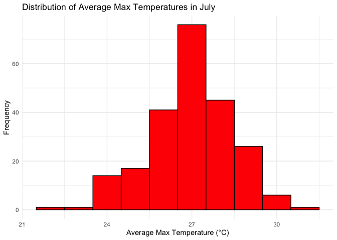
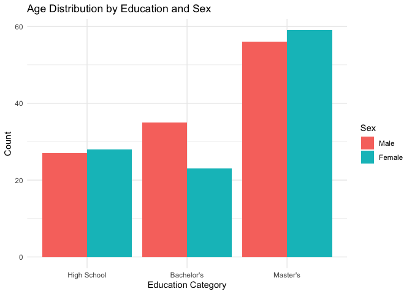

Homework 3
================
Samina Rashiq

## Problem 1

This dataset is a subset of National Oceanic and Atmospheric Association
(NOAA) weather data from January 1, 1981 to December 31, 2010. The data
is from **747 weather stations** in New York state and includes
**2,595,176 rows** and **7 columns**.

Key variables include weather station ID (`id`), date of observation
(`date`), precipitation in tenths of millimeters (`prcp`), snowfall in
millimeters (`snow`), snow depth in millimeters (`sndw`), maximum
temperature in tenths of degrees Celsius (`tmax`), and minimum
temperature in tenths of degrees Celsius (`tmin`).

While each row contains a weather station ID and date, there is
significant missing data across the remaining variables. Specifically,
the columns for precipitation, snowfall, snow depth, maximum
temperature, and minimum temperature are **5.62%**, **14.69%**,
**22.8%**, **43.71%**, and **43.71%** empty respectively.

Missing data for precipitation, snowfall, and snow depth is likely due
to days where those weather events did not occur and may not be a
significant issue. However, the substantial amount of missing data for
both maximum and minimum temperature poses a challenge, as nearly half
of the rows lack this information.

#### Most commonly observed snowfall values in NY state

| Snowfall (mm) | Frequency of Snowfall Value |
|--------------:|----------------------------:|
|           0.0 |                     2008508 |
|           2.5 |                       31022 |
|           1.3 |                       23095 |
|           5.1 |                       18274 |
|           7.6 |                       10173 |
|           0.8 |                        9962 |
|           0.5 |                        9748 |
|           3.8 |                        9197 |
|           0.3 |                        8790 |
|          10.2 |                        6552 |

0mm of snowfall is the most common value because snow generally only
falls in certain months (November to March) and does not happen daily.
This is followed by 2.5mm, 1.3mm, 5.1mm, and 7.6mm. These values are
small and this makes sense because NY state is not very snowy compared
to other places (e.g., Quebec, 10-30mm per day in these months).

#### Average max temperature in January and July for each station from 1981-2010

<!-- --><!-- -->

The structure of the plots for average max temperatures for both January
and July appear to follow a relatively symmetrical and normal looking
distribution. Neither plot appears to have obvious outliers.

``` r
# Convert tmin and tmax to numeric to avoid errors
ny_noaa <- ny_noaa |>
  mutate(
    tmin = as.numeric(tmin),
    tmax = as.numeric(tmax)
  )

# Panel 1: tmin (X) vs tmax (Y) using Hexbin plot for density
ggplot(ny_noaa, aes(x = tmin / 10, y = tmax / 10)) +
  geom_hex(bins = 50) +  # Hexbin plot to show density
  scale_fill_viridis_c() +
  labs(title = "tmax vs tmin (Hexbin Density Plot)", x = "Minimum Temperature (°C)", y = "Maximum Temperature (°C)") +
  theme_minimal()
```

    ## Warning: Removed 1136276 rows containing non-finite outside the scale range
    ## (`stat_binhex()`).

<!-- -->

``` r
# Filter snowfall values greater than 0 and less than 100
snow_filtered <- ny_noaa |>
  filter(snow > 0 & snow < 100) |>
  mutate(snow_mm = snow / 10)  # Convert snow to mm

# Panel 2: Snowfall distribution by year (Boxplot)
ggplot(snow_filtered, aes(x = factor(year), y = snow_mm)) +
  geom_boxplot(fill = "lightblue") +
  labs(title = "Distribution of Snowfall (0 < Snow < 100mm) by Year", x = "Year", y = "Snowfall (mm)") +
  theme_minimal() +
  theme(axis.text.x = element_text(angle = 90, hjust = 1))  # Rotate x-axis labels for clarity
```

<!-- -->

## Problem 2

``` r
#import demographics data
nhanes_covar <- read.csv("nhanes_covar.csv", header = FALSE, skip = 4)

colnames(nhanes_covar) <- nhanes_covar[1, ]
nhanes_covar <- nhanes_covar[-1, ]

#assign variable classes to demographics data
nhanes_covar$SEQN <- as.character(nhanes_covar$SEQN)

nhanes_covar$sex <- factor(
  nhanes_covar$sex,
  levels = c("1", "2"),
  labels = c("Male", "Female")
)

nhanes_covar$age <- as.numeric(nhanes_covar$age)

nhanes_covar$BMI <- as.numeric(nhanes_covar$BMI)

nhanes_covar$education <- factor(
  nhanes_covar$education,
  levels = c("1", "2", "3", "4"),
  labels = c("High School", "Bachelor's", "Master's", "PhD"),
  ordered = TRUE  # Specifies that it is ordinal data
)

#filter demographics data for missing values
nhanes_covar_filtered <- nhanes_covar %>%
  filter(age >= 21 & 
         !is.na(sex) & 
         !is.na(age) & 
         !is.na(BMI) & 
         !is.na(education))

#import accelerometer data
nhanes_accel <- read.csv("nhanes_accel.csv")

#assign variable classes to accelerometer data
nhanes_accel$SEQN <- as.character(nhanes_accel$SEQN)

nhanes_accel <- nhanes_accel %>%
  mutate(across(-SEQN, as.numeric))

#merge
nhanes_merged <- merge(nhanes_covar_filtered, nhanes_accel, by = "SEQN")
```

``` r
library(knitr)
library(ggplot2)

#make sex/education table
sex_education_table <-
    table(nhanes_merged$education,
    nhanes_merged$sex)

kable(sex_education_table, caption = "Number of Men and Women in Each Education Category")
```

|             | Male | Female |
|:------------|-----:|-------:|
| High School |   27 |     28 |
| Bachelor’s  |   35 |     23 |
| Master’s    |   56 |     59 |
| PhD         |    0 |      0 |

Number of Men and Women in Each Education Category

``` r
#make grouped bar plot of education grouped by sex
ggplot(nhanes_merged, aes(x = education, fill = sex)) +
  geom_bar(position = "dodge") +  # 'dodge' creates side-by-side bars for each gender
  labs(title = "Age Distribution by Education and Sex",
       x = "Education Category",
       y = "Count",
       fill = "Sex") +  # Legend label
  theme_minimal()
```

<!-- -->
The number of men and women appear to be relatively balanced across all
four education categories. While gender differences do not appear to be
an issue, there seems to be a higher proportion of participants at the
master’s level, which could bias the results.

``` r
nhanes_merged$total_activity <- rowSums(nhanes_merged[, grep("^min", colnames(nhanes_merged))])

ggplot(nhanes_merged, aes(x = age, y = total_activity, color = sex)) +
  geom_point() +  
  geom_smooth(method = "lm", se = FALSE) + 
  facet_wrap(~education) + 
  labs(title = "Total Activity vs Age by Education Level and Sex",
       x = "Age",
       y = "Total Activity",
       color = "Sex") +  
  theme_minimal()
```

    ## `geom_smooth()` using formula = 'y ~ x'

<!-- -->
Total activity declines with age across all education levels. For those
with a high school education, males start with higher activity but drop
below females later in life. In contrast, females maintain higher
activity levels for those with bachelor’s and master’s degrees. The
decline in activity appears to slow as education levels increase.

``` r
#gather minute-level data into a long format
nhanes_long <- nhanes_merged %>%
  pivot_longer(cols = starts_with("min"), 
               names_to = "minute", 
               values_to = "activity") %>%
  mutate(minute = as.numeric(gsub("min", "", minute)))

#calculate average activity per minute by education and sex
average_activity <- nhanes_long %>%
  group_by(education, sex, minute) %>%
  summarise(avg_activity = mean(activity, na.rm = TRUE))
```

    ## `summarise()` has grouped output by 'education', 'sex'. You can override using
    ## the `.groups` argument.

``` r
#plot activity time courses
ggplot(average_activity, aes(x = minute, y = avg_activity, color = sex)) +
  geom_line() +  # Original line plot
  geom_smooth(se = FALSE, color = "black", size = 0.5) +  # Smooth trend in black and thinner
  facet_wrap(~education) +
  labs(title = "24-Hour Activity Time Course by Education Level and Sex",
       x = "Minute of Day",
       y = "Average Activity",
       color = "Gender") +
  theme_minimal() + 
  scale_x_continuous(breaks = seq(0, 1440, by = 720),
                     labels = c("12 AM", "12 PM", "12 AM"))
```

    ## Warning: Using `size` aesthetic for lines was deprecated in ggplot2 3.4.0.
    ## ℹ Please use `linewidth` instead.
    ## This warning is displayed once every 8 hours.
    ## Call `lifecycle::last_lifecycle_warnings()` to see where this warning was
    ## generated.

    ## `geom_smooth()` using method = 'gam' and formula = 'y ~ s(x, bs = "cs")'

<!-- -->

The graph suggests that those with a high school diploma as their
highest education level are the most active overall for males and
females around mid-day Those with bachelors and masters degrees seem to
have a bimodal activity pattern around mid-day, while those with a high
school diploma see a steady decrease in activity from noon onwards. The
graph seems to suggest that rising and sleeping times are relatively
similar accross education levels, based on where the peaks begin and
end. In all three groups, females appear to be more active than males.
Overall, it seems like gender is a smaller factor in determining
activity throughout the day than is level of education.
